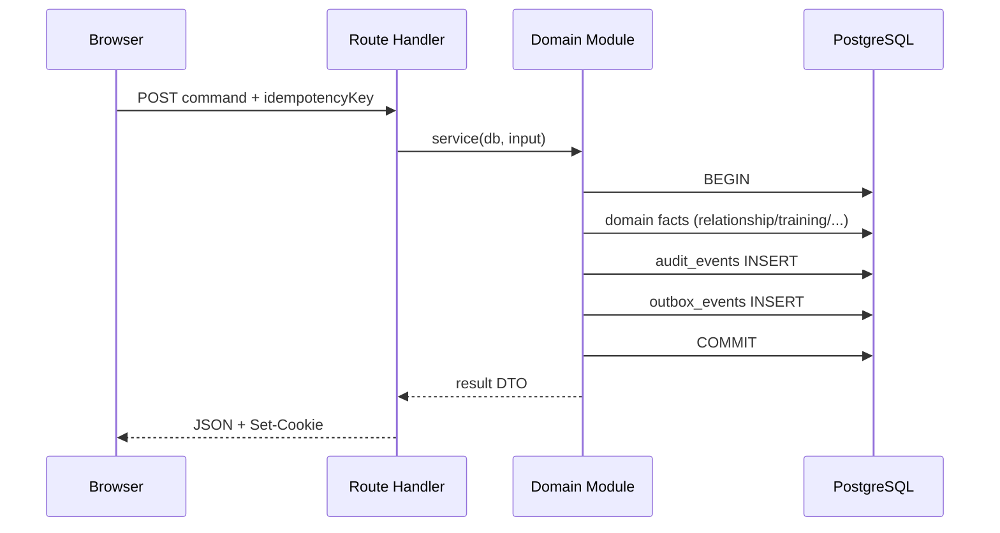

# M1 验收缺口修复 — 技术设计

## 1. 设计原则

- **不推翻 M1 Module 边界**：在 `identity/`、`family-access/`、`training/`、`audit/` 内增量修改；历史 M1 任务文档只读。
- **事实源不变**：`relationships.status` 仍为授权事实；outbox 与 audit 只追加。
- **同一事务**：领域写入 + audit + outbox 原子提交；失败则全部 rollback。
- **幂等键语义化**：DB 复合 UNIQUE 为最终防线；应用层校验 actor 与 resource 归属。

## 2. 缺陷分析：训练幂等键（R1）

### 2.1 现状

```text
training_sessions.start_idempotency_key   UNIQUE (global)
training_sessions.submit_idempotency_key  UNIQUE (global)

startTrainingSession:  WHERE start_idempotency_key = :key
submitTrainingSession:   WHERE submit_idempotency_key = :key
```

**风险**：学生 B 调用 start 使用与学生 A 相同的 key → 命中 A 的行 → 返回 A 的 `sessionId`。

### 2.2 目标模型

| 命令 | 复合唯一键（PostgreSQL） | 应用查询 |
| --- | --- | --- |
| start | `(student_id, start_idempotency_key)` WHERE key IS NOT NULL | `studentId + key` |
| submit | `(student_id, submit_idempotency_key)` WHERE key IS NOT NULL | `studentId + key`（session 已属 student） |

**额外规则**：

- 回放时验证 `existing.studentId === input.studentId`；不等则视为 **新命令**（复合 UNIQUE 允许插入）。
- submit 回放时验证 `existing.id === input.sessionId`；不匹配返回 `409 IDEMPOTENCY_SESSION_MISMATCH`（防跨 session 复用 key）。

### 2.3 迁移 `0005_training_idempotency_scope.sql`（expand-only）

```sql
-- 1. Drop global uniques (expand phase; no data loss)
ALTER TABLE training_sessions
  DROP CONSTRAINT IF EXISTS training_sessions_start_idempotency_unique;
ALTER TABLE training_sessions
  DROP CONSTRAINT IF EXISTS training_sessions_submit_idempotency_unique;

-- 2. Add scoped uniques
CREATE UNIQUE INDEX training_sessions_start_idempotency_scoped
  ON training_sessions (student_id, start_idempotency_key)
  WHERE start_idempotency_key IS NOT NULL;

CREATE UNIQUE INDEX training_sessions_submit_idempotency_scoped
  ON training_sessions (student_id, submit_idempotency_key)
  WHERE submit_idempotency_key IS NOT NULL;
```

**兼容性**：

- 已有 session 行保留；仅约束定义变化。
- 若历史数据存在「同 key 不同 student」（理论上 global unique 不允许同 key 两行，但可能存在 null key 行），迁移前跑诊断 `SELECT start_idempotency_key, COUNT(DISTINCT student_id) ... HAVING COUNT(*) > 1`。
- Drizzle schema 同步更新：移除单列 `unique()`，改为 `uniqueIndex` + `where`（或 SQL 迁移手写 partial unique）。

**回滚**：恢复 global unique 仅当不存在跨 student 重复 key；否则不可安全 rollback 约束，只能 rollback 应用。

## 3. 单方解除关联（R3）

### 3.1 API

```text
POST /api/relationships/:relationshipId/end
Body: { idempotencyKey, initiatedBy: "parent" | "student" }  // initiatedBy 由 session role 推导，不信任 body 覆盖
```

### 3.2 事务步骤（单 tx）

```text
1. SELECT relationship FOR UPDATE WHERE id = :id AND status = 'active'
2. VERIFY actor is parent_id OR student_id on row
3. UPDATE relationships SET status='ended', ended_at=now(), ended_by=:actor
4. UPDATE family_memberships SET left_at=now()
     WHERE family_id = :familyId AND user_id IN (parent_id, student_id) AND left_at IS NULL
5. increment authorization_epoch(parent_id), authorization_epoch(student_id)
6. appendAuditEvent(relationship.ended)
7. appendOutboxEvent(RelationshipEnded)
```

**授权读取**：现有 `requireActiveRelationship` 仅查 `status=active` → 解除后自动 403，无需改调用方逻辑。

**会话失效**：依赖已有 `validateSession` epoch 比对；解除后 epoch++ → 旧 cookie 无效。

### 3.3 Schema

- `relationships` 已有 `ended_at`、`ended_by`（M1 迁移 0002）；无需新表。
- 可选索引：`(parent_id, student_id, status)` 已够用。

## 4. 事务 Outbox（R4）

### 4.1 表结构（最小 M1 子集）

对齐 `docs/data-model.md` §6：

```text
outbox_events
  id                 uuid PK
  aggregate_type     text NOT NULL      -- e.g. "invitation", "relationship", "training_session"
  aggregate_id       uuid NOT NULL
  event_type         text NOT NULL      -- e.g. "invitation.redeemed"
  event_version      integer NOT NULL DEFAULT 1
  dedupe_key         text NOT NULL UNIQUE
  payload            jsonb NOT NULL     -- 类型化、无 secrets
  status             text NOT NULL DEFAULT 'pending'  -- pending|processed|dead (M1 仅 pending)
  available_at       timestamptz NOT NULL DEFAULT now()
  created_at         timestamptz NOT NULL DEFAULT now()
```

M1 **不**实现 `worker_attempts`、租约、dead 处理。

### 4.2 模块 API

```typescript
// src/modules/outbox/append-outbox-event.ts
appendOutboxEvent(tx, {
  aggregateType, aggregateId, eventType, eventVersion,
  dedupeKey,  // 与命令 idempotency 或 audit 对齐，如 "outbox:rel-accept:{idempotencyKey}"
  payload,
})
```

**事务边界**：

```text
db.transaction(async (tx) => {
  // domain mutations
  appendAuditEvent(tx, ...)
  appendOutboxEvent(tx, ...)   // 同一 tx，失败则 rollback
})
```

**禁止模式**：

```text
await db.transaction(() => { /* facts only */ })
await appendOutboxEvent(db, ...)  // ❌ 分离事务
```

### 4.3 覆盖事件映射

| 领域命令 | event_type | dedupe_key 示例 |
| --- | --- | --- |
| registerParent 成功 | `invitation.redeemed` | `outbox:invite-redeem:{registerIdempotencyKey}` |
| acceptRelationship | `relationship.accepted` | `outbox:rel-accept:{respondKey}` |
| endRelationship | `relationship.ended` | `outbox:rel-end:{idempotencyKey}` |
| submitTraining completed | `training_session.completed` | `outbox:training-complete:{submitKey}` |

### 4.4 迁移

`0006_outbox_events.sql` — 新表，无 backfill（历史命令不补写）。

## 5. 受控学生与首次改密（R6）

### 5.1 Schema 扩展 `0007_controlled_student_password.sql`

```text
users.must_change_password  boolean NOT NULL DEFAULT false
users.password_changed_at   timestamptz NULL
```

### 5.2 API

```text
POST /api/family/students
  Auth: requireParentSession + contactVerified
  Body: { username, birthDate, displayName, initialPassword, idempotencyKey }

POST /api/auth/change-password
  Auth: requireStudentSession
  Body: { currentPassword, newPassword, idempotencyKey }
  → 设置 must_change_password=false, password_changed_at=now(), authorization_epoch++
```

### 5.3 门禁

```typescript
requireStudentSessionForTraining() {
  const ctx = await requireStudentSession()
  if (ctx.dbUser.mustChangePassword) throw TrainingError("PASSWORD_CHANGE_REQUIRED")
  return ctx
}
```

应用于：`POST /api/training/sessions`、`POST .../events`、`POST .../submit`、关联码签发（可选：允许改密前查看 dashboard 但不可训练）。

**年龄**：`birthDate` 解析 `resolveAgeBand`；创建时校验 5–12（M1 路径 A）。

## 6. 浏览器 UI 与数据流（R2）

### 6.1 页面清单

| 路径 | 角色 | 职责 |
| --- | --- | --- |
| `/register` | 公开 | 邀请码 + 家长注册 |
| `/verify-contact` | 家长 pending | OTP 确认 |
| `/login` | 全部 | 用户名/邮箱 + 密码 |
| `/parent/students/new` | 家长 | 受控学生开户（R6） |
| `/student/change-password` | 学生 | 首次/强制改密 |
| `/parent/link` | 家长 | 输入关联码 |
| `/student/link` | 学生 | 展示关联码 + 待处理申请列表 |
| `/student/training/reaction` | 学生 | 训练 UI（Space/Enter/点击） |
| `/student/training/[sessionId]` | 学生 | 结果 + 刷新重读 |
| `/parent/students/[studentId]/training` | 家长 | 训练汇总只读 |
| `/` | 全部 | 角色分流首页（跳转上述入口） |

### 6.2 数据流（示例：训练完成）

```text
[Browser Client Component]
  → POST /api/training/sessions { trainingKey, idempotencyKey: uuid() }
  ← { sessionId, expectedTrialCount }
  → loop: POST .../events { sequence, eventType, payload }
  → POST .../submit { idempotencyKey: uuid() }
  → router.push(/student/training/:sessionId)
  → GET /api/training/sessions/:id  (Server Component 或 client fetch)
  → 硬刷新重复 GET（E2E 断言 metrics 一致）
```

**原则**：

- 指标只读 API 返回；UI 不计算 median/accuracy。
- Idempotency key 由客户端 `crypto.randomUUID()` 生成；**禁止**硬编码常量 across users。
- 360px：`max-w-md mx-auto px-4`、按钮 `min-h-11`、训练区 `min-h-[200px]`。

### 6.3 E2E 策略

- 新 spec：`tests/e2e/m1-browser-flow.spec.ts` — **真实浏览器点击**，非纯 `request` API。
- 使用 admin bootstrap API 或 seed 创建邀请码（可保留 `scripts/e2e-bootstrap.ts` 扩展）。
- 360px：`test.use({ viewport: { width: 360, height: 640 } })` 单独 project 或 describe。

## 7. Prettier（R5）

- 对当前 22 个 warn 文件执行 `pnpm format:write`（或新增 script alias）。
- 确认 `.prettierrc` 与 ESLint 不冲突。
- 无功能变更 PR 可单独 commit hunk，但本任务允许与功能同 PR。

## 8. 管理员 TOTP（R7 — 仅文档）

见 `research/m1-deferrals.md`：

- 状态：**延期至 M3**
- 风险：**生产上线阻断项**（路线图已列）
- 代码：`login` 对 admin 不启用 TOTP 检查；不在 UI 添加假 TOTP 字段

## 9. 授权与 Outbox 事务边界总览



**解除关联读路径**：

```text
GET /api/students/:id/training-summary
  → requireParentSession
  → requireActiveRelationship  // ended → 403
  → validateSession epoch      // 旧 session → 401
```

## 10. 回滚方案

| 变更 | 回滚应用 | 回滚数据 |
| --- | --- | --- |
| R1 幂等 scope | Deploy 上一版本；旧版 global unique 与新数据可能冲突 — **优先 forward fix** | 保留 session 行 |
| R3 解除 API | 关闭 `POST .../end` 路由 | ended 行保留（只追加） |
| R4 outbox | 停止写入 outbox 调用 | 表可空留 |
| R6 改密/开户 | 关闭新路由 | 新列默认值安全 |
| R2 UI | 删除 pages，API 仍可用 | — |
| R5 Prettier | 无 | — |

**功能开关（可选 env，implement 阶段选用）**：

- `FEATURE_RELATIONSHIP_END=false`
- `FEATURE_CONTROLLED_STUDENT_CREATE=false`

## 11. 目录增量

```text
src/modules/outbox/append-outbox-event.ts
src/modules/family-access/end-relationship.service.ts
src/modules/identity/change-password.service.ts
src/modules/identity/create-controlled-student.service.ts
src/db/schema/outbox.ts
src/db/migrations/0005_*.sql … 0007_*.sql
src/app/(auth)/register/page.tsx …
src/app/(student)/student/training/reaction/page.tsx …
tests/integration/training/idempotency-scope.test.ts
tests/integration/family-access/end-relationship.test.ts
tests/integration/outbox/outbox-transaction.test.ts
tests/e2e/m1-browser-flow.spec.ts
.trellis/tasks/08-25-m1-verification-remediation/research/m1-deferrals.md
```

## 12. 与 CONTEXT / data-model 对齐

| 规则 | 设计对应 |
| --- | --- |
| 关联解除立即撤权 | R3 ended + epoch |
| 改密会话失效 | R6 change-password epoch++ |
| outbox 与事实同事务 | R4 §4.2 |
| 命令携带 idempotency_key | R1 复合 UNIQUE |
| 训练结果服务端计算 | UI 只读 GET，不变 |
